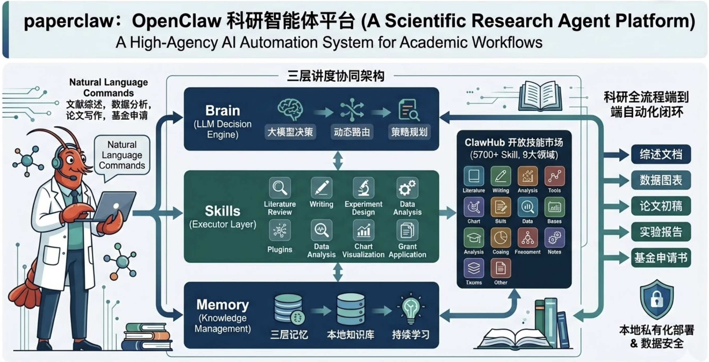

<p align="center">
  
</p>

<h2 align="center"><b>PaperClaw — 面向学术科研工作者的高能动性AI自动化辅助系统</b></h2>

<p align="center">
  <b><i><font size="5">大脑(LLM决策引擎) + 手脚(Skill插件执行层) + 记忆(Memory知识管理) 三层协同架构</font></i></b>
</p>

<p align="center">
  
</p>

<p align="center">
  <a href="LICENSE"></a>
  <a href="https://python.org"></a>
  <a href="#testing"></a>
</p>

---

## � Web UI 界面

**PaperClaw** 现已提供现代化的 Web 用户界面，让您无需命令行即可轻松使用！

### ✨ 主要特性

- 🎨 **专业深色主题** — 现代化UI设计，护眼配色
- 🚀 **一键启动研究** — 输入主题即可开始23阶段自动化流程
- 📊 **实时进度追踪** — 可视化显示每个阶段的执行状态
- 💾 **智能配置保存** — API Key自动保存，无需重复输入
- 📄 **结果在线查看** — 直接预览和下载生成的论文、代码等产物

### 🚀 快速开始 Web UI

```bash
# 1. 启动后端API服务
cd paperclaw-web/backend
pip install -r requirements.txt
python app.py

# 2. 启动前端界面（新终端）
cd paperclaw-web/frontend
npm install
npm run dev

# 3. 访问浏览器
# 打开 http://localhost:5173
```

详细使用说明请查看 [`paperclaw-web/USAGE.md`](paperclaw-web/USAGE.md)

---

## � 系统定位

**PaperClaw** 是一套面向学术科研工作者的高能动性 AI 自动化辅助系统。针对传统科研流程中的系统性痛点：

- 📚 **文献检索耗时** — 多源文献自动检索与筛选
- 🔄 **数据处理重复** — 智能实验设计与自动化执行
- ✍️ **论文写作周期冗长** — AI辅助写作与多轮审稿
- 📝 **基金申请繁琐** — 结构化知识管理与复用

本系统以大语言模型（LLM）为决策核心，构建了**大脑 + 手脚 + 记忆**三层协同架构，实现科研全流程端到端的智能自动化闭环。

---

## 🏗️ 三层协同架构

### 🧠 大脑层 — LLM决策引擎

**核心能力**: 智能决策与任务编排

- 支持多种LLM提供商（OpenAI、DeepSeek、Anthropic、OpenRouter等）
- 动态多模型路由（复杂任务自动切换最优模型）
- ACP协议支持（Agent Client Protocol）
- MetaClaw跨运行学习集成

**技术特性**:
- 自然语言驱动，无需编程基础
- 上下文感知的智能提示词管理
- 多Agent协同决策机制

### 🦾 手脚层 — Skill插件执行层

**核心能力**: 科研任务自动化执行

依托 **ClawHub 开放技能市场**（5700+ 科研 Skill），覆盖9大科研领域：

1. **文献综述** — 多源检索、智能筛选、知识提取
2. **论文写作** — 大纲生成、分段撰写、格式转换
3. **实验设计** — 假设生成、方案设计、代码生成
4. **数据分析** — 统计分析、结果可视化、报告生成
5. **代码生成** — 硬件感知、沙盒执行、自我修复
6. **可视化** — 图表生成、架构图绘制、TikZ/Matplotlib
7. **同行评审** — 多Agent辩论、方法论一致性检查
8. **引用验证** — 4层验证机制、反幻觉防护
9. **知识管理** — 结构化存储、跨会话复用

**执行模式**:
- 🏖️ **Sandbox模式** — 本地沙盒安全执行
- 🐳 **Docker模式** — 容器化隔离执行
- 🌐 **SSH远程** — GPU服务器远程执行
- ☁️ **Colab Drive** — Google Colab协同执行

### 🧬 记忆层 — Memory知识管理

**核心能力**: 持续学习与知识沉淀

**三层记忆机制**:

1. **短期记忆** — 当前运行的上下文状态
   - 实验结果缓存
   - 中间产物版本控制
   - 实时决策日志

2. **中期记忆** — 知识库(KB)系统
   - 6大类别结构化存储
   - Markdown/Obsidian双后端
   - 跨会话知识复用

3. **长期记忆** — 自我进化系统
   - 从失败中提取Lessons
   - 30天时间衰减机制
   - 自动生成可复用Skills

**知识库分类**:
```
docs/kb/
├── questions/     # 研究问题
├── literature/    # 文献知识卡片
├── experiments/   # 实验设计与结果
├── findings/      # 研究发现
├── decisions/     # 决策记录与理由
└── reviews/       # 同行评审意见
```

---

## 🔬 23阶段智能流水线

```
Phase A: 研究范围界定          Phase E: 实验执行
  1. TOPIC_INIT                  12. EXPERIMENT_RUN
  2. PROBLEM_DECOMPOSE           13. ITERATIVE_REFINE  ← 自我修复

Phase B: 文献发现              Phase F: 分析决策
  3. SEARCH_STRATEGY             14. RESULT_ANALYSIS    ← 多Agent
  4. LITERATURE_COLLECT  ← 真实API  15. RESEARCH_DECISION  ← PIVOT/REFINE
  5. LITERATURE_SCREEN   [门控]
  6. KNOWLEDGE_EXTRACT           Phase G: 论文写作
                                 16. PAPER_OUTLINE
Phase C: 知识综合               17. PAPER_DRAFT
  7. SYNTHESIS                   18. PEER_REVIEW        ← 证据检查
  8. HYPOTHESIS_GEN    ← 辩论     19. PAPER_REVISION

Phase D: 实验设计              Phase H: 最终化
  9. EXPERIMENT_DESIGN   [门控]   20. QUALITY_GATE      [门控]
 10. CODE_GENERATION             21. KNOWLEDGE_ARCHIVE
 11. RESOURCE_PLANNING           22. EXPORT_PUBLISH     ← LaTeX
                                 23. CITATION_VERIFY    ← 相关性检查
```

> **门控阶段** (5, 9, 20) 可暂停等待人工审批，或使用 `--auto-approve` 自动通过。

> **决策循环**: 阶段15可触发 REFINE (→ 阶段13) 或 PIVOT (→ 阶段8)，自动版本控制。

---

```

输出 → `artifacts/pc-YYYYMMDD-HHMMSS-<hash>/deliverables/` — 可编译的LaTeX、BibTeX、实验代码、图表。

---

## ✨ 核心创新

| 创新点 | 描述 |
|--------|------|
| **🔄 三层记忆架构** | 短期(上下文) + 中期(知识库) + 长期(自我进化)，AI从工具演进为具备持续学习能力的数字科研伙伴 |
| **🎯 动态多模型路由** | 根据任务复杂度自动选择最优LLM，复杂实验自动路由到OpenCode Beast Mode |
| **🌐 开放Skill生态** | ClawHub技能市场5700+科研技能，用户可自定义扩展 |
| **🛡️ 本地私有化部署** | 支持完全离线运行，确保未发表数据与敏感成果的合规安全 |
| **🧬 自我进化系统** | 从每次运行中提取Lessons，30天时间衰减，未来运行自动避免已知陷阱 |
| **🤖 多Agent协同** | 假设生成、结果分析、同行评审均采用结构化多视角辩论 |

---

## 🚀 使用场景

### 场景1: 文献综述自动化
```bash
paperclaw run --topic "Transformer模型在时间序列预测中的应用" \
              --mode literature-review \
              --auto-approve
```
**输出**: 
- 50+篇相关文献（OpenAlex + Semantic Scholar + arXiv）
- 知识卡片提取（方法、数据集、结果）
- 研究空白分析
- 综述大纲

### 场景2: 实验设计与执行
```bash
paperclaw run --topic "基于注意力机制的异常检测算法" \
              --mode experiment \
              --gpu-required \
              --auto-approve
```
**输出**:
- 可运行的Python代码（硬件感知）
- 沙盒/Docker执行结果
- 统计分析与可视化
- 实验报告

### 场景3: 论文全流程生成
```bash
paperclaw run --topic "多模态学习在医学影像诊断中的应用" \
              --mode full-auto \
              --conference neurips_2025 \
              --auto-approve
```
**输出**:
- 完整学术论文（5000-6500词）
- NeurIPS/ICML/ICLR LaTeX模板
- 真实引用（4层验证）
- 实验代码与结果
- 同行评审报告

---

## 🛡️ 安全与合规

### 数据安全
- ✅ 支持完全本地部署（无需联网）
- ✅ 敏感数据不上传云端
- ✅ Docker沙盒隔离执行
- ✅ 网络策略精细控制（none/setup_only/pip_only/full）

### 学术诚信
- ✅ 4层引用验证（arXiv ID → CrossRef DOI → Semantic Scholar → LLM相关性）
- ✅ 反AI生成痕迹检测
- ✅ 方法论-证据一致性检查
- ✅ NeurIPS审稿清单自动检查

### 可复现性
- ✅ 完整实验代码与环境配置
- ✅ 随机种子固定
- ✅ 版本控制与回滚
- ✅ 执行日志完整记录

---

## 🎓 技术架构优势

### vs 传统科研工具
| 维度 | 传统工具 | PaperClaw |
|------|---------|-----------|
| **自动化程度** | 单点工具，需人工串联 | 端到端全流程自动化 |
| **学习成本** | 需学习多个工具 | 自然语言驱动，零编程基础 |
| **知识沉淀** | 分散存储，难以复用 | 结构化知识库，跨会话复用 |
| **持续优化** | 静态工具 | 自我进化，从失败中学习 |
| **私有化部署** | 多数依赖云服务 | 支持完全离线运行 |

### vs AI Scientist / AutoResearch
| 维度 | AI Scientist | PaperClaw |
|------|--------------|-----------|
| **技能生态** | 封闭系统 | 开放Skill市场(5700+) |
| **记忆机制** | 单次运行 | 三层记忆，持续学习 |
| **多模型支持** | 单一模型 | 动态多模型路由 |
| **本地化** | 依赖云API | 支持完全私有化部署 |
| **知识管理** | 无结构化存储 | 6类知识库 + Obsidian集成 |

---

## 📦 系统要求

### 最低配置
- Python 3.11+
- 8GB RAM
- 20GB 磁盘空间

### 推荐配置
- Python 3.11+
- 16GB RAM
- NVIDIA GPU (CUDA 11.8+) 或 Apple Silicon (MPS)
- 50GB 磁盘空间
- Docker (可选，用于沙盒执行)

### 依赖服务
- LLM API（OpenAI/DeepSeek/Anthropic等，或本地部署）
- 文献API（可选，提高检索质量）:
  - Semantic Scholar API Key
  - arXiv API（免费）
  - OpenAlex API（免费）

---

## 🔧 配置示例

```yaml
# config.paperclaw.yaml
project:
  name: "my-research"
  mode: "full-auto"

research:
  topic: "你的研究主题"
  domains: ["machine-learning", "nlp"]
  daily_paper_count: 10

llm:
  provider: "openai-compatible"
  base_url: "https://api.openai.com/v1"
  api_key_env: "OPENAI_API_KEY"
  primary_model: "gpt-4o"
  fallback_models: ["gpt-4o-mini"]

experiment:
  mode: "sandbox"  # sandbox | docker | ssh_remote
  time_budget_sec: 300
  sandbox:
    python_path: ".venv/bin/python3"
    gpu_required: false

# MetaClaw集成（可选 — 跨运行学习）
metaclaw_bridge:
  enabled: true
  skills_dir: "~/.metaclaw/skills"
  lesson_to_skill:
    enabled: true
    min_severity: "warning"
```

---

## 🌟 路线图

### v1.1 (2026 Q2)
- [ ] ClawHub技能市场Web界面
- [ ] 可视化流程编排器
- [ ] 多语言支持（英文、中文、日文）
- [ ] 移动端监控App

### v1.2 (2026 Q3)
- [ ] 基金申请书自动生成
- [ ] 专利撰写辅助
- [ ] 科研团队协作模式
- [ ] 知识图谱可视化

### v2.0 (2026 Q4)
- [ ] 多模态输入（语音、图像、视频）
- [ ] 实时科研助手（类ChatGPT界面）
- [ ] 云端SaaS版本
- [ ] 企业级权限管理

---

## 🤝 贡献指南

我们欢迎所有形式的贡献！

- 🐛 **Bug报告**: 提交Issue并附上复现步骤
- 💡 **功能建议**: 在Discussions中讨论新想法
- 🔧 **代码贡献**: Fork → 开发 → Pull Request
- 📚 **文档改进**: 修正错误、补充示例
- 🎨 **Skill开发**: 贡献新的科研技能到ClawHub

详见 [CONTRIBUTING.md](CONTRIBUTING.md)

---

## 📄 开源协议

MIT License — 详见 [LICENSE](LICENSE)

---

## 📌 引用

如果PaperClaw对你的研究有帮助，请引用：

```bibtex
@software{paperclaw2026,
  title = {PaperClaw: 面向学术科研工作者的高能动性AI自动化辅助系统},
  author = {PaperClaw Team},
  year = {2026},
  url = {https://github.com/1692775560/PaperClaw},
  note = {大脑(LLM决策引擎) + 手脚(Skill插件执行层) + 记忆(Memory知识管理) 三层协同架构}
}
```

---

## 🙏 致谢

PaperClaw基于以下开源项目改进而来：

- 🔬 [AutoResearchClaw](https://github.com/aiming-lab/AutoResearchClaw) — 自动化研究流水线
- 🧠 [MetaClaw](https://github.com/aiming-lab/MetaClaw) — 跨运行学习系统
- 🌐 [OpenClaw](https://github.com/openclaw/openclaw) — Agent协议标准

特别感谢开源社区的贡献者们！

---

<p align="center">
  <sub>用 🦞 和 ❤️ 构建 | PaperClaw Team © 2026</sub>
</p>
